# lucascoelho74
<h2 align="left">Hi 👋! My name is Lucas Coelho and I'm a Future Back-End Developer, from Brazil</h2>

###

  
  

###

###

  
  
  

###

  
  

###

 

<picture>
  <source media="(prefers-color-scheme: dark)" srcset="https://raw.githubusercontent.com/lucascoelho74/lucascoelho74/snake-output/snake-dark.svg" />
  <source media="(prefers-color-scheme: light)" srcset="https://raw.githubusercontent.com/lucascoelho74/lucascoelho74/snake-output/snake.svg" />
  
</picture>

###
